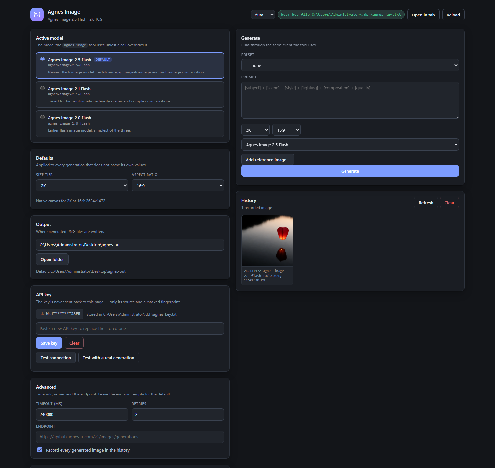
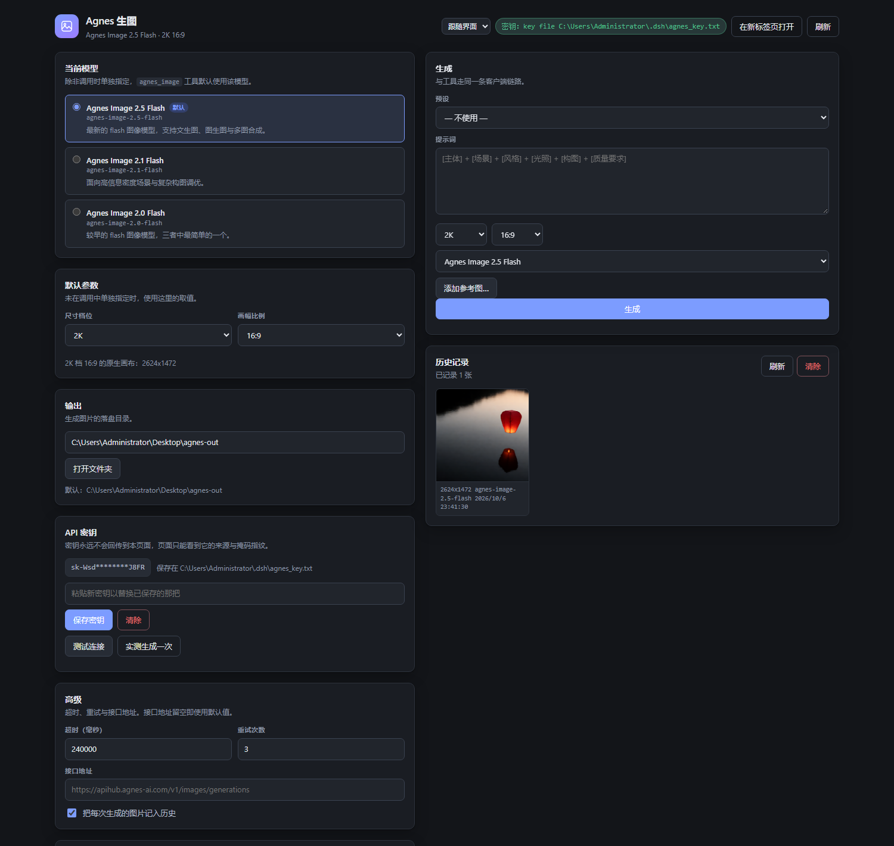

# dsh-plugin-agnes-image

Agnes image generation for [DeepSeek Harness](https://github.com/deepseek-ai) (dsh):
a model-facing `agnes_image` tool, and a settings-page console for everything a
tool call should not have to carry around.

Two halves, one package:

- **Host half** — registers the `agnes_image` tool and serves a small loopback HTTP
  API (settings, key management, history, generation).
- **Browser half** — adds one section to **Settings → Agnes Image**, which embeds the
  console page the host half serves.

Zero runtime dependencies: Node built-ins plus the global `fetch`. Node ≥ 22.

| | |
| --- | --- |
| Upstream API | `POST https://apihub.agnes-ai.com/v1/images/generations` |
| Models | `agnes-image-2.5-flash` (default), `agnes-image-2.1-flash`, `agnes-image-2.0-flash` |
| Capabilities | text-to-image, image-to-image, multi-image composition |
| Cost | every tier and every reference image was free at the time of writing |



## What you get

**1. The tool.** The model calls `agnes_image` and gets a real PNG on disk plus a
JSON result it can act on.

| Parameter | Type | Required | Notes |
| --- | --- | --- | --- |
| `prompt` | string | ✅ | Structure that works well: subject + scene + style + lighting + composition + quality |
| `size` | string | | Tier: `1K` / `2K` / `3K` / `4K`. Default `2K` |
| `ratio` | string | | `1:1` `3:4` `4:3` `16:9` `9:16` `2:3` `3:2` `21:9`. Default `1:1` |
| `model` | string | | One-off override of the configured model |
| `images` | string[] | | Reference images for image-to-image or composition. Absolute local path, `http(s)://`, or `data:` URI |
| `out` | string | | Absolute output path. Defaults to `agnes-<timestamp>-<prompt slug>.png` in the configured output directory |

Returns `{ ok, path, url, bytes, model, size, ratio, nativePixels, prompt, revisedPrompt, keySource }`,
and renders a model-readable summary that includes a Markdown image reference.

**2. The console.** Settings → **Agnes Image**:

| Section | What it does |
| --- | --- |
| Active model | Pick which of the three image models the tool uses by default |
| Defaults | Size tier + aspect ratio, with a live preview of the native pixel size |
| Output | Where PNGs are written, plus "Open folder" |
| API key | Masked fingerprint and source; replace or clear the stored key; test the connection; test with a real generation |
| Advanced | Timeout, retries, endpoint override, history on/off |
| Prompt presets | Save, reuse and delete prompt templates |
| Generate | A full workbench: preset, prompt, size, ratio, model, reference-image upload, result preview |
| History | A thumbnail gallery of everything generated, from the tool or from the console |

The console speaks **English and Chinese**, switched from the picker in its top
bar. The settings-section label follows the shell's own language, so the section
is listed as *Agnes Image* or *Agnes 生图* depending on what dsh is using.
`Auto` (the default) means "follow the shell, then the browser"; an explicit
`English` or `中文` pins it and is remembered across restarts.

<details>
<summary>The same console in Chinese</summary>



</details>

Every change takes effect on the next generation — no restart, no remount. The
plugin merges its effective configuration at call time from (highest first) the
operator's patch-row config, the console's saved settings, and built-in defaults.

## Install

This package is not on npm. Wire it into a dsh profile as a local plugin:

```bash
# 1. Clone anywhere.
git clone <this repo> /path/to/dsh-plugin-agnes-image

# 2. Link it into the profile that dsh actually runs.
cd ~/.dsh/profiles/desktop          # or whichever profile you use
pnpm add "link:/path/to/dsh-plugin-agnes-image"
```

`link:` needs an absolute path. On Windows across drives a relative path cannot
be expressed at all, so `link:D:/dsh-plugin/dsh-plugin-agnes-image` is the normal
form. If you would rather not use pnpm, a directory junction works just as well:

```powershell
New-Item -ItemType Junction `
  -Path "$HOME\.dsh\profiles\desktop\node_modules\dsh-plugin-agnes-image" `
  -Target "D:\dsh-plugin\dsh-plugin-agnes-image"
```

**3. Register the bundle.** The link alone is not enough. Open the profile's
`package.json` and append the package name to `dsh.profile.bundles`:

```json
{
  "dsh": {
    "profile": {
      "bundles": [
        "@deepseek-ai/dsh-base",
        "@deepseek-ai/dsh-web-app",
        "dsh-plugin-agnes-image"
      ]
    }
  }
}
```

A package that is linked but missing from `dsh.profile.bundles` will never load,
and dsh will not tell you why.

**4. Restart dsh.** Once. The host half then hot-reloads on its own, but the
browser half is composed into the boot graph at startup (see
[Notes from the field](#notes-from-the-field)).

### Uninstall

Remove the entry from `dsh.profile.bundles`, remove the dependency, and delete the
link. On Windows, delete a junction with `cmd /c rmdir <link>` — **not**
`Remove-Item -Recurse`, which follows the link and deletes your source tree.

## API key

`lib/agnes.js` resolves the key in this order:

1. An explicit `apiKey` in the plugin config
2. `AGNES_AI_API_KEY`, then `AGNES_API_KEY`
3. A key file named by the config
4. The first existing default key file:
   - `~/.dsh/agnes_key.txt`
   - `~/.agnes/api_key.txt`

A key file is plain text; surrounding whitespace is trimmed. On startup the plugin
logs `[agnes-image] API key source: …` — the source, never the key.

The console can write the key for you, at mode `0600`. It never reads the key back
into the page: `GET /agnes-image/state` returns a masked fingerprint
(`sk-Wsd********J8FR`) and a source description, and nothing else.

> **Keep the key out of the repository.** `.gitignore` already excludes
> `agnes_key.txt` and `.env`. Upstream asks the same: never put an API key in a
> public repo, in front-end code, or in a screenshot.

To override without touching any file, set `AGNES_AI_API_KEY` in the environment
and restart dsh.

## HTTP API

The console is an ordinary web page talking to ordinary routes, so anything it can
do is scriptable:

| Method | Path | Purpose |
| --- | --- | --- |
| `GET` | `/agnes-image/state` | Everything the console boots from: settings, key status, model catalog |
| `POST` | `/agnes-image/settings` | Patch settings; returns the new state |
| `POST` | `/agnes-image/key` | Store or clear the API key |
| `POST` | `/agnes-image/test` | `{mode:"auth"}` lists models; `{mode:"generate"}` runs one real generation |
| `POST` | `/agnes-image/generate` | Generate; appends to history |
| `POST` | `/agnes-image/upload` | Stage a reference image |
| `GET` | `/agnes-image/history` | History, newest first |
| `POST` | `/agnes-image/history/clear` | Clear history (leaves the images on disk) |
| `GET` | `/agnes-image/image?path=…` | Serve a generated image |
| `POST` | `/agnes-image/reveal` | Open the output folder in the OS file manager |
| `GET` | `/agnes-image/console` | The console page itself |
| `GET` | `/agnes-image/console.css`, `/agnes-image/console.js` | Its assets |

These routes do **not** inherit dsh's own origin fence — exact matches beat its
prefix — so the plugin implements the check itself: the `Host` header must be
loopback, `sec-fetch-site: cross-site` is refused, and a present `Origin` must
match `Host` exactly. A missing `Origin` is allowed so `curl` and scripts keep
working. `GET /agnes-image/image` additionally refuses any path that is neither
inside the configured output directory nor present in the history, so the route
cannot be turned into an arbitrary file read.

```bash
curl -s http://127.0.0.1:19387/agnes-image/state

curl -s -X POST http://127.0.0.1:19387/agnes-image/generate \
  -H 'content-type: application/json' \
  -d '{"prompt":"a red paper lantern over still black water","size":"1K","ratio":"16:9"}'
```

## Layout

```
dsh-plugin-agnes-image/
├── package.json          dsh.bundle.patch and dsh.client are the two fields that matter
├── cordis.patch.yml      bundle layer: one plain insert naming the row
├── lib/
│   ├── index.js          plugin entry: apply(ctx, config) → ctx.tools.register(…)
│   ├── agnes.js          pure client: key resolution, request, retry, download, save
│   ├── settings.js       defaults, validation, atomic persistence
│   ├── history.js        JSONL generation log
│   └── routes.js         the HTTP API, including the origin fence
├── client/index.js       browser half: one settings.section registration
├── console/              the console page: plain HTML, CSS and DOM, no build step
├── test/                 node --test, no network
└── scripts/              manual smoke tests that hit the live API
```

### Why the console is an iframe

The browser half could have been written as a native React panel. It is a
single `settings.section` slot that renders an `<iframe>` instead, for three
reasons:

- A packaged dsh has **no HMR for third-party client bundles**. Every mistake in
  the browser half costs an application restart, so the half was kept as small as
  it can possibly be while the real UI lives somewhere reloadable.
- The console page depends on nothing but `react` for the slot itself. No client
  store, no UI-primitives component signatures, no styling conventions that shift
  between releases.
- It is a plain URL. It can be opened in a tab, reloaded, and screenshotted by a
  headless browser during development.

## Notes from the field

Things that cost time, written down so they cost nobody else any:

- **`response_format` must live in `extra_body.response_format`.** At the top level
  the request is rejected. The upstream docs warn about this explicitly.
- **Image-to-image goes through `extra_body.image`** (an array of strings). Do
  **not** send `tags: ["img2img"]`.
- **Prefer tiers over literal pixel sizes.** `1920x1080` and `2560x1440` are not
  native and get normalized (typically to 16:9 at 1K, `1312x736`). Ask for
  `size:"2K"` + `ratio:"16:9"` and crop downstream. The `nativePixels` field
  reports what the API actually returned so you can check.
- **`agnes-image-2.0-flash` accepts `size` + `ratio` too**, even though its
  documentation only lists `size` with literal pixel examples. Verified by
  generating at 1K/16:9 and reading the PNG header: `1312x736`.
- **Retries** cover `408 409 425 429 500 502 503 504` with exponential backoff
  `min(1500 × 2^(n-1), 30s)`. Everything else is a real answer and is not retried.
- **`revisedPrompt` is always an empty string** on this endpoint. Do not depend on it.
- **A third-party client bundle cannot hot-reload in a packaged install.** HMR
  exists only when dsh runs from a source checkout with `pnpm run dev:web`
  watching. Adding or changing `dsh.client` needs a restart.
- **Do not import `@deepseek-ai/dsh-settings`.** On 0.2.0-rc.2 the service has no
  `settings.register(namespace, …)` and no `settings.get(namespace)`; a
  module-level missing export kills the whole plugin load. Settings live in a
  plugin-private store instead — a `settings.json` under `~/.dsh/agnes-image/`,
  written atomically (temp file + `fsync` + `rename`) at mode `0600`, which is
  what every installed out-of-tree plugin in this install actually does.
- **Never mix the two persistence paths** for one value. The host's config
  schema/patch layer and a plugin-private store are two writers, and they
  overwrite each other.
- **Relative URLs only in the browser half.** The loopback port is random
  (`--port 0`) and changes on every restart, so nothing may be keyed to an origin.
- **`label` in a slot registration is a function**, re-read on every projection,
  not a string.

## Development

```bash
node --test test/*.test.mjs          # 54 tests, no network, no dsh
```

The suite covers the parts that fail silently or dangerously: the origin fence,
settings validation and round-trips, history tolerance for corrupt lines, the
native-pixel table's internal consistency, and the browser half's loader
envelope and slot registration (executed in a `vm` with a stub shell).

`test/i18n.test.mjs` is worth a note: it reads `console.js` as text and fails the
build on a missing translation, a key with no `zh` counterpart, a `{placeholder}`
that exists in one language but not the other, a dead entry nobody references —
or a user-visible sentence hidden in a string literal or in a CSS `content:`.
Both of those last two shipped once and were caught by eye in a screenshot, which
is exactly the review that should not be manual.

Smoke tests hit the live API and are run by hand:

```bash
node scripts/smoke-text-to-image.mjs
node scripts/smoke-image-to-image.mjs <reference.png>
node scripts/smoke-tool.mjs
```

To iterate on the console, skip dsh entirely — the page is served by the plugin's
own routes, so it can run standalone against the same settings file:

```bash
node scripts/preview-console.mjs               # http://127.0.0.1:8791/agnes-image/console
node scripts/preview-console.mjs --port 9000
```

Then screenshot it:

```bash
chrome --headless=new --disable-gpu --hide-scrollbars \
  --window-size=1500,1420 --virtual-time-budget=9000 \
  --screenshot=console.png "http://127.0.0.1:8791/agnes-image/console?theme=dark&lang=zh"
```

`?theme=light|dark` overrides the palette; without it the page follows the OS.
The host passes the shell's theme when it embeds the page, because inside an
iframe `prefers-color-scheme` tracks the operating system rather than the
application. `?lang=en|zh` works the same way, but only while the saved
preference is `Auto` — an explicit choice always wins over the shell's hint.

## License

MIT — see [LICENSE](LICENSE).

---

[中文说明](README.zh-CN.md)
